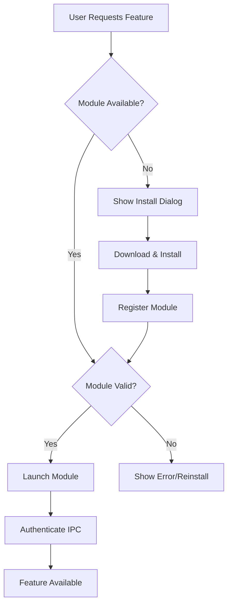
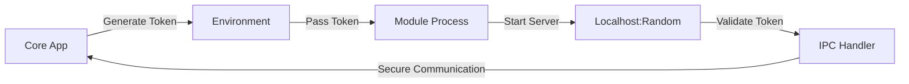
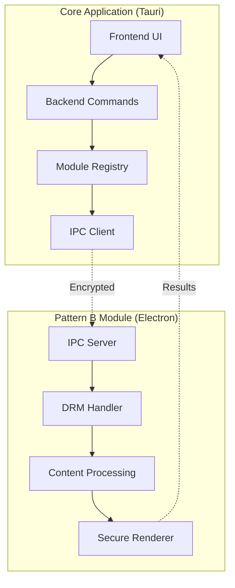

# 🚀 Phase 2 Planning: Pattern B Implementation

**Date**: October 6, 2025
**Status**: Planning Phase
**Previous Phase**: Phase 1 (Pattern A) - ✅ Complete
**Current Focus**: Pattern B (Optional Module System)

---

## 🎯 Phase 2 Overview

Phase 2 implements **Pattern B**: an optional, separately-distributed Electron module system that enables advanced features like DRM support while maintaining the lightweight core application from Phase 1.

### Key Principles
- **Progressive Enhancement**: Core app works without modules
- **Security-First**: Every module is signed, sandboxed, and token-authenticated
- **User Control**: All module installations are user-initiated and reversible
- **Independence**: Modules update separately from the main application

---

## 📋 Phase 2 Roadmap (6 Sub-Phases)

### Phase 2.1: Foundation & Packaging 🏗️
**Timeline**: Q1 2026 (3-4 months)
**Prerequisites**: Phase 1 deployed and stable

#### Core Deliverables
- [ ] **Electron Builder Configuration**
  - Platform-specific build configs (macOS, Windows, Linux)
  - Code signing certificates and workflows
  - Automated CI/CD for module builds

- [ ] **Security Infrastructure**
  - Code signing setup for all platforms
  - Certificate management and rotation
  - Update server with signature verification

- [ ] **Module Architecture**
  - Base module template with enforced security flags
  - IPC authentication framework
  - Logging and telemetry infrastructure

#### Success Criteria
- ✅ Signed, distributable modules for all platforms
- ✅ Automated build pipeline producing verified artifacts
- ✅ Security audit passes for module framework

---

### Phase 2.2: Detection & Registry 🔍
**Timeline**: Q1-Q2 2026 (2-3 months)
**Dependencies**: Phase 2.1 complete

#### Core Deliverables
- [ ] **Module Registry System**
  - Local module database (`~/.playa/modules.json`)
  - Version compatibility matrix
  - Module metadata and capabilities

- [ ] **Detection Logic**
  - Robust module discovery and validation
  - Signature verification pipeline
  - Health check and diagnostics

- [ ] **Backend Integration**
  - Complete `detect_electron_module()` implementation
  - Registry management commands
  - Error handling and fallback logic

#### Success Criteria
- ✅ Reliable module detection across all platforms
- ✅ Signature verification prevents malicious modules
- ✅ Graceful handling of corrupted/missing modules

---

### Phase 2.3: Installation Experience 📦
**Timeline**: Q2 2026 (3-4 months)
**Dependencies**: Phase 2.2 complete

#### Core Deliverables
- [ ] **Download & Install UI**
  - Progress indicators and cancellation
  - Platform-specific installer integration
  - Post-install verification and registration

- [ ] **User Experience Flow**
  - Clear consent and privacy notices
  - Disk space and dependency checks
  - Install/uninstall wizard

- [ ] **Error Handling**
  - Network failure recovery
  - Installation rollback on failure
  - Clear error messaging and support links

#### Success Criteria
- ✅ Smooth installation experience across platforms
- ✅ Users can easily install, update, and remove modules
- ✅ Clear understanding of what each module provides

---

### Phase 2.4: Secure Communication 🔐
**Timeline**: Q2-Q3 2026 (2-3 months)
**Dependencies**: Phase 2.3 complete

#### Core Deliverables
- [ ] **IPC Authentication**
  - Token-based authentication system
  - Session management and expiration
  - Request/response encryption

- [ ] **Communication Protocol**
  - JSON-RPC or custom protocol implementation
  - Bi-directional event channels
  - Timeout and retry mechanisms

- [ ] **Security Validation**
  - Penetration testing of IPC layer
  - Token security audit
  - Communication flow verification

#### Success Criteria
- ✅ Secure, authenticated communication between core app and modules
- ✅ No unauthorized access to sensitive functionality
- ✅ Robust error handling for communication failures

---

### Phase 2.5: Update & Maintenance 🔄
**Timeline**: Q3 2026 (2-3 months)
**Dependencies**: Phase 2.4 complete

#### Core Deliverables
- [ ] **Automatic Updates**
  - Background update checking
  - Delta patching for efficiency
  - Rollback on failed updates

- [ ] **User Notifications**
  - Update availability alerts
  - Changelog and release notes
  - User control over update timing

- [ ] **Maintenance Tools**
  - Module health diagnostics
  - Cache management and cleanup
  - Performance monitoring

#### Success Criteria
- ✅ Modules stay current with security patches
- ✅ Users informed about updates without being annoying
- ✅ System remains stable during update process

---

### Phase 2.6: Management Interface 🎛️
**Timeline**: Q3-Q4 2026 (2-3 months)
**Dependencies**: Phase 2.5 complete

#### Core Deliverables
- [ ] **Settings Integration**
  - Module management panel in main app
  - Install/uninstall/update controls
  - Module configuration options

- [ ] **Monitoring Dashboard**
  - Module status and health indicators
  - Usage statistics and performance metrics
  - Troubleshooting and support tools

- [ ] **User Education**
  - In-app help and documentation
  - Feature discovery and onboarding
  - Privacy and security explanations

#### Success Criteria
- ✅ Users can easily manage all aspects of modules
- ✅ Clear visibility into module status and performance
- ✅ Comprehensive help and support resources

---

## 🏛️ Technical Architecture Deep Dive

### Module Lifecycle Management


### Security Model


### Data Flow Architecture


---

## 📊 Implementation Strategy & Priorities

### Development Approach
1. **Incremental Delivery**: Each sub-phase delivers working functionality
2. **Security-First**: Security reviews at every milestone
3. **User-Centric**: UX testing and feedback at each stage
4. **Platform Parity**: Consistent experience across macOS, Windows, Linux

### Risk Mitigation
| Risk | Impact | Mitigation Strategy |
|------|--------|-------------------|
| **Code Signing Costs** | High | Budget for certificates, consider EV certs for Windows |
| **Platform Store Approval** | Medium | Focus on direct distribution initially |
| **DRM Licensing Complexity** | High | Defer DRM selection until Phase 2.3 |
| **User Adoption** | Medium | Clear value proposition, optional feature |
| **Security Vulnerabilities** | High | Regular audits, automated security testing |

### Resource Requirements
- **Development Team**: 2-3 developers (Rust/TypeScript/Security)
- **Infrastructure**: Code signing infrastructure, update servers
- **Testing**: Security auditing, multi-platform testing
- **Timeline**: 12-18 months total (can be parallelized)

---

## 🎨 User Experience Design

### Module Discovery Flow
```
1. User encounters feature requiring module
   ↓
2. "Feature requires additional component" dialog
   ↓
3. Clear explanation of what will be installed
   ↓
4. Download progress with ability to cancel
   ↓
5. Success confirmation with feature now available
```

### Settings Management
```
Main Settings → Modules & Extensions
├── Installed Modules
│   ├── [Module Name] [Version] [Status: Active/Inactive/Updating]
│   ├── Size: XXX MB, Last Updated: Date
│   └── [Update] [Configure] [Remove]
├── Available Modules
│   └── [Browse] [Install from File]
└── Advanced
    ├── Update Settings (Auto/Manual/Notify)
    ├── Storage Location
    └── Diagnostics & Logs
```

---

## 🔬 Research & Development Topics

### Phase 2.1 Research Priorities
1. **DRM Provider Selection**
   - Widevine CDM licensing and distribution requirements
   - Alternative DRM solutions (FairPlay, PlayReady)
   - Cost analysis and technical complexity

2. **Update Server Architecture**
   - CDN requirements for global distribution
   - Delta patching algorithms and efficiency
   - Bandwidth and storage cost projections

3. **Code Signing Strategy**
   - Multi-platform certificate management
   - Automated signing in CI/CD pipelines
   - Certificate renewal and rotation procedures

### Advanced Features (Future Consideration)
- **Module Sandboxing**: OS-level isolation beyond Electron sandbox
- **Plugin Architecture**: Allow third-party module development
- **Enterprise Features**: Centralized module management for organizations
- **Analytics Integration**: Usage patterns and performance monitoring

---

## 📈 Success Metrics & KPIs

### Technical Metrics
- **Installation Success Rate**: >95% successful module installations
- **Update Reliability**: >99% successful updates without rollback
- **Security Score**: Zero critical vulnerabilities in production
- **Performance Impact**: <10% overhead from module system

### User Experience Metrics
- **Adoption Rate**: % of users who install at least one module
- **User Satisfaction**: >4.5/5 rating for module installation experience
- **Support Burden**: <5% of support tickets related to modules
- **Retention**: Module users have >20% higher app retention

### Business Metrics
- **Development Velocity**: Module system enables faster feature development
- **Market Differentiation**: Competitive advantage from modular architecture
- **Cost Efficiency**: Reduced bandwidth costs from selective downloads
- **Ecosystem Growth**: Third-party developer interest and contributions

---

## 🚀 Getting Started with Phase 2

### Immediate Next Steps (Week 1-2)
1. **Technical Architecture Review**
   - Finalize module communication protocol
   - Design security token system
   - Plan certificate acquisition and management

2. **Project Setup**
   - Create Phase 2 development branch
   - Set up project tracking and milestones
   - Establish security review checkpoints

3. **Research & Planning**
   - DRM provider research and selection
   - Update server architecture design
   - Code signing certificate procurement

### First Month Goals
- [ ] Complete technical specification for Phase 2.1
- [ ] Acquire necessary code signing certificates
- [ ] Set up development and testing infrastructure
- [ ] Begin implementation of core module framework

---

## 🤝 Team & Collaboration

### Recommended Team Structure
- **Lead Developer**: Overall architecture and coordination
- **Security Engineer**: Code signing, authentication, vulnerability assessment
- **Frontend Developer**: UI/UX for module management
- **DevOps Engineer**: CI/CD, distribution, and update infrastructure

### External Dependencies
- **Certificate Authorities**: Code signing certificates
- **CDN Provider**: Global distribution of module binaries
- **Security Auditor**: Independent security assessment
- **DRM Provider**: Licensing and technical integration

---

## 📚 Documentation & Knowledge Management

### Phase 2 Documentation Plan
- [ ] **Technical Specification**: Detailed architecture and implementation
- [ ] **Security Guide**: Threat model, mitigation strategies, audit procedures
- [ ] **User Manual**: Installation, usage, and troubleshooting
- [ ] **Developer Guide**: Module development and integration
- [ ] **Operations Manual**: Deployment, monitoring, and maintenance

### Knowledge Transfer
- [ ] Architecture decision records (ADRs)
- [ ] Security review reports and recommendations
- [ ] Performance benchmarks and optimization guides
- [ ] Troubleshooting playbooks and known issues

---

## 🎯 Conclusion

Phase 2 represents a significant evolution of the Playa_Tay application, transforming it from a single-purpose tool into a modular platform capable of supporting advanced features while maintaining its lightweight core.

The 6-phase approach ensures:
- **Incremental Value**: Each phase delivers working functionality
- **Risk Management**: Security and stability at every step
- **User Focus**: Clear benefits and smooth experience
- **Future Growth**: Foundation for continued expansion

**Next Action**: Begin Phase 2.1 planning and resource allocation.

---

**Phase 2 Planning Complete** ✅
**Ready to Begin Implementation** 🚀
**Estimated Timeline**: 12-18 months
**Success Probability**: High (building on solid Phase 1 foundation)
